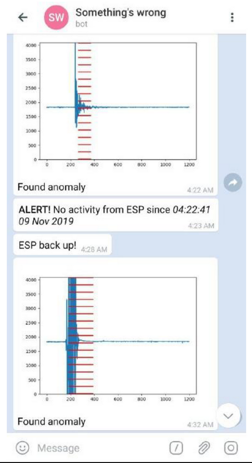
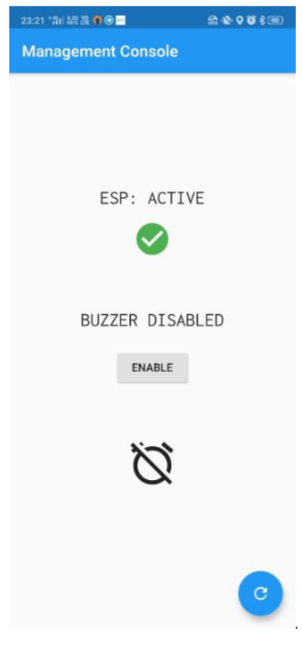
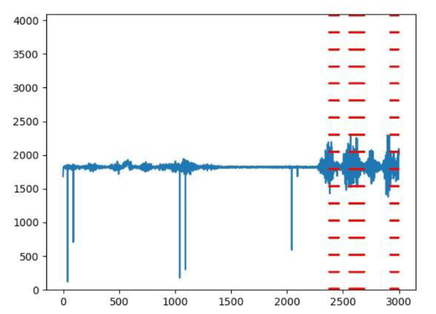
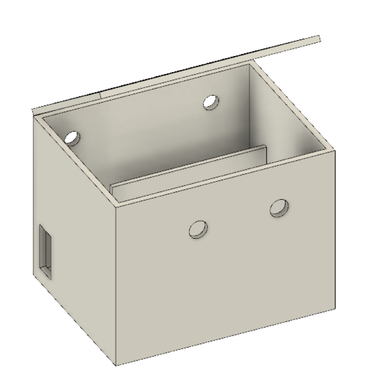

# _Wachsam_

_Wachsam_ is our complete end-to-end IoT-based abnormal activity detection system. You can install the hardware in areas to be notified of any abnormally loud sounds,
like a dog barking or persons' cries of distress, etc. It is useful for isolated public places or dimly-lit areas, and requires very low installation and operating costs.

As soon as the remote device detects an abnormality, it notifies you of the event via Telegram, and turns a loud hooter on the remote site to discourage any bad actors.
You can control enable/disable these behaviors via an Android app.

For complete user-facing and developer-facing details, see [our documentation](https://github.com/yoogottamk/abnormal-activity-detection/blob/master/Documentation.pdf).

## **Key features**

1. Device detects "abnormally" loud (above average) sounds in an radius of 10-15 meters
2. Device adapts well to the surrounding noise level. For example, if a school corridor _gradually_ becomes noisy due to incoming students, the device will auto adjust its baseline figures
and only gets triggered only if something anomalous happens (a student screams/a loud thud happens/etc.)
2. We provide a Telegram bot to instantly notify you of abnormal events detected by the device
3. We provide an Android application to remotely enable/disable the device 

## **Key Pictures**

### Telegram bot

On Telegram, you get notified every time:

1. The microcontroller goes offline or online
2. Microncontroller detects abnormally loud sound. The graph denotes the amplitude of the voice relative to the surroundings before and after the event.

### Android app

On the Android app, you can remotely enable/disable the buzzer.

### Detection algorithm

The algorithm is robust:

1. against outliers, which may happen due to faults in the sound detection hardware itself
2. in detecting actual abnormal events,

both of which are higlighted in the figure below

### 3D printed box

This is the enclosure in which we put our 1. battery 2. microcontroller 3. piezoelectric hooter.

## Future work

Being able to _hear_ the very loud sound that caused an abnormal event would be extremely helpful.
This audio log could be sent as an standard mp3 file on Telegram along with the regular alert, so the receiver could decide on their own the severity of the instance.
We should of course do this only in a privacy oriented manner, for example, by using on-device processing and discarding audio logs older than a minute.

To benefit users from all platforms, we could integrate the enable/disable and other configuration commands directly with the Telegram chatbot instead of having to requiring a separate mobile app install.
